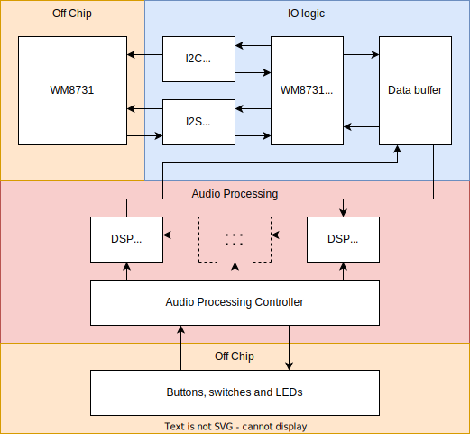

# audio-effects
Audio processing on a DE2-70 FPGA. The implementation follows the following diagram:



To generate Verilog do:
```
make run
```

To run a simulation do:
```
make test
```
Note: Some tests require a sound file in the root directory named ```sample.wav```.

To quickly see waveforms from simulation do:
```
make wave
```
or simulate and waveforms in one command:
```
make test wave
```

More options for configuring make targets can be specified in a config.mk file. An example could be:
```
TESTTARGET = audio.AudioProcessingFrameSpec
WAVETARGET = test_run_dir/AudioProcessingFrame_should_play/AudioProcessingFrame.vcd
WAVECONFIG = test_run_dir/wave.gtkw
DIAGRAMTARGET = $(CURDIR)/build/FIRFilter.fir
DIAGRAMMERDIR = ~/repos/diagrammer
```

The signal path is defined in ```src/main/scala/audio/DSPModules.scala```:
```
class DSPModules {
  // Specify which effects to use
  var effects: List[DSPModule] = List(
    Module(new NoiseGate(0xc0, false, 16)),
    Module(new ClampDistortion(16, true, 16)),
    Module(new MovingAverage(16, true)),
    Module(new VolumeControl(32, false))
  )
}
```
This would create the signal path: ```-> NoiseGate -> ClampDistortion -> MovingAverage -> VolumeControl```.

You can specify whether or not to use stereo in ```src/main/scala/Top.scala``` by setting the boolean argument:
```
object Main extends App {
  // Generate the Verilog output
  emitVerilog(new Top(stereo = true), args)
}
```
Using stereo will obviously use more hardware, but in some cases it is necessary for high quality audio.

To program the FPGA, plug in your DE2-70 development board via USB blaster and make sure you have Quartus 13 installed. Run the following command:
```
make program
```
Plug in an AUX cable to the ```LINE IN``` plug and either a speaker or headphones to the ```LINE OUT``` plug. Play some audio and you should hear it come through. Make sure to unplug the USB blaster after programming the FPGA since it can introduce noise into the signal path. If the audio does not come through right away you might need to press ```KEY0``` (reset) a few times.